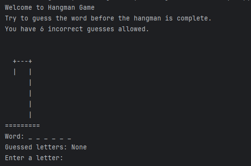
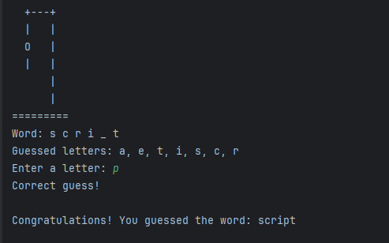
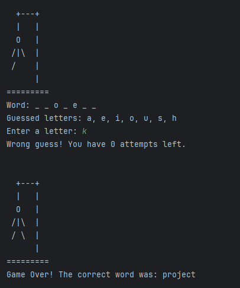
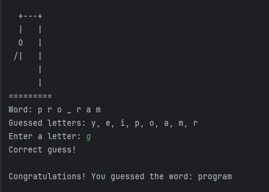

# CodeAlpha – Python Programming Tasks  
## Project Title: Hangman Game  

### Objective
To develop a simple text-based **Hangman Game** using Python that allows users to guess a hidden word within a limited number of attempts.

---

### Key Concepts Used
- `random` module for random word selection  
- `while` loop and `if-else` statements for game control  
- Lists and strings for word display and updates  
- User input/output handling  
- ASCII art for hangman visualization  

---

### Tools and Technologies
- **Language:** Python 3  
- **IDE:** PyCharm (or any Python IDE)  
- **Platform:** Console-based program  

---

### Project Description
This program simulates the classic **Hangman Game** in a text-based format.

1. The program randomly selects a word from a predefined list.  
2. The player guesses letters one at a time.  
3. Each incorrect guess adds a part to the hangman drawing.  
4. The player wins if they guess all letters before the hangman is fully drawn.  
5. The game ends after **6 wrong attempts**, displaying “GAME OVER.”  

---

### Output Screenshots

 **1. Game Start Screen**
  
 
 **2. Correct Guess Example**
 
 
 **3. Wrong Guess Example**
  
 
 **4. Win Screen**
  

---

### How to Run
1. Clone or download this repository.  
2. Open the project in PyCharm or your preferred IDE.  
3. Run the Python file `hangman.py`.  
4. Follow the on-screen prompts to make guesses.

---

### Conclusion
This project strengthened my understanding of **Python fundamentals**, **control flow**, and **string manipulation**.  
It also enhanced my confidence in building **interactive console-based programs** and using **loops and conditionals effectively**.

---

### Author
**Rughma Malik**  
5th Semester Software Engineering Student, Fatima Jinnah Women University
