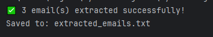
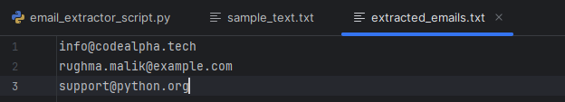

#  CodeAlpha – Python Programming Tasks  
## Project Title: Task Automation with Python Scripts 
### - Email Extraction Automation Script  

### Objective  
To automate the process of extracting all valid email addresses from a text file and saving them into a new file.  
This script demonstrates Python’s power in handling repetitive file-based text processing tasks.

---

### Key Concepts Used  
- **Regular Expressions (re):** To detect valid email patterns.  
- **File Handling:** Reading input and writing extracted data to another file.  
- **Sets and Lists:** To store and remove duplicate email addresses.  
- **Automation Logic:** A self-contained script that can run on any text file.  

---

### Tools and Technologies  
- **Language:** Python 3  
- **IDE:** PyCharm (or any Python IDE)  
- **Platform:** Console-based program  

---

### Project Description  
This program reads a given `.txt` file, automatically searches for all email addresses using a regex pattern, removes duplicates, and saves them to a new file.  

It helps in tasks like cleaning email data from documents, logs, or web-scraped text.

---

### How It Works  
1. Place your input file (e.g., `sample_text.txt`) in the same directory.  
2. Run the Python script.  
3. The program extracts all valid emails and saves them to `extracted_emails.txt`.  
4. Displays the total number of emails found.  

---

### Example  
####  [View sample_text.txt](sample_text.txt)
####  [View extracted_emails.txt](extracted_emails.txt)

---

### Output Screenshots

**Input text file** containing sample text with email addresses.  
  

**Program running in terminal**, showing successful extraction message.  
 

**Output file** displaying all extracted and unique email addresses.  
  

---

### Conclusion  
This task enhanced my understanding of **regex**, **file handling**, and **automation scripting** in Python.  
It also demonstrated how Python can automate data cleaning and extraction tasks efficiently.

---

### Author
**Rughma Malik**  
5th Semester Software Engineering Student, Fatima Jinnah Women University
